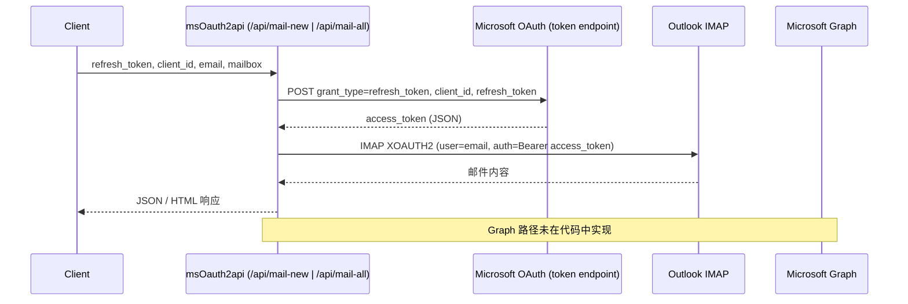

# 学习型代码导读：msOauth2api 的 Token 流与邮件读取实现

本文不是普通的项目介绍，而是一份面向学习者的静态代码分析报告。我们将从源代码出发，完整梳理 refresh_token 的进入点、如何换取 access_token、以及 access_token 如何被用于 IMAP XOAUTH2 读取 Outlook 邮件。并明确指出：当前仓库未实现首次 OAuth 授权流程（Authorization Code + PKCE），仅覆盖“使用现有 refresh_token 换取 access_token 并读取邮件”的后半段流程。

本文所有结论均可回溯到仓库代码，链接均为相对路径指向源码位置。全程静态分析，无需也不使用任何真实凭据。

## 1. 项目一句话解释

这是一个部署在 Vercel 的 Serverless Web Service，接收调用方提供的 Microsoft OAuth2 refresh_token 与 client_id，从 Microsoft OAuth Token Endpoint 换取 access_token，并使用 IMAP XOAUTH2 协议连接 `outlook.office365.com` 读取邮箱中的邮件（包含提取 6 位验证码的逻辑）。项目不实现首次授权，仅封装了“持有 refresh_token 后的取信能力”。

## 2. 学习目标

通过本仓库可以聚焦学习：

- Serverless API 与路由形态（Vercel 风格）
- HTTP 请求与响应（query 参数校验、JSON/HTML 返回）
- OAuth 2.0 Refresh Token Grant（仅后半段）
- Bearer Token 用于 IMAP XOAUTH2（而非 Microsoft Graph）
- IMAP XOAUTH2 登录与邮件读取
- API 封装与最小职责划分
- 基于错误文本透传的错误处理风险
- Token 安全边界与最小暴露面

## 3. 项目目录地图

仅列与理解实现相关的关键文件：

```
api/
├── mail-new.js        # 获取最新一封邮件；refresh_token -> access_token -> IMAP XOAUTH2 -> 单封邮件
├── mail-all.js        # 获取全部邮件；refresh_token -> access_token -> IMAP XOAUTH2 -> 多封邮件
├── process-inbox.js   # 清理 INBOX；同样先换 token，再 IMAP 操作（删除/清空）
└── process-junk.js    # 清理 Junk；同样先换 token，再 IMAP 操作（删除/清空）
package.json           # 依赖：node-imap、mailparser 等（无 Graph SDK）
vercel.json            # Vercel 构建环境（无自定义路由映射）
README.md              # 面向使用者的接口说明（非本学习文档）
```

## 4. 总体架构

Mermaid 架构图（区分 Graph 与 IMAP 回退路径；本项目仅实现 IMAP 路径，Graph 未实现）：

```mermaid
flowchart LR
    Client[Client] -->|refresh_token, client_id, email, mailbox| API[API Route (/api/*)]
    API -->|POST grant_type=refresh_token| OAuth[Microsoft OAuth Token Endpoint]
    OAuth -->|access_token| API
    subgraph Data Access
      API -->|XOAUTH2 (Bearer access_token)| IMAP[Outlook IMAP\noutlook.office365.com:993]
      API -. not implemented .-> Graph[Microsoft Graph]
    end
    IMAP -->|邮件数据| API
    API -->|JSON/HTML| Client
```

说明：
- 代码中确实存在对 `https://login.microsoftonline.com/consumers/oauth2/v2.0/token` 的 POST 请求（见后文证据）。
- 未发现任何对 `graph.microsoft.com` 的调用；因此 Graph 路径标注为“未实现”。

## 5. 一次完整请求发生了什么（以 /api/mail-new 为例）

参考源码：[api/mail-new.js](./api/mail-new.js)

1. 客户端传入什么  
   - Query 参数：`refresh_token`、`client_id`、`email`、`mailbox`、`response_type`（可选，`json`/`html`）。
   - 代码位置：`module.exports` 顶层从 `req.query` 解构（行 38）。
2. 路由如何解析参数  
   - Vercel 约定式路由，文件即路由；直接从 `req.query` 获取参数并校验非空（行 41-43）。
3. 哪个函数负责换 Token  
   - `get_access_token(refresh_token, client_id)`（行 4-30）。  
   - POST 到 Microsoft OAuth Token Endpoint，`grant_type=refresh_token`，成功后从 JSON 中取 `access_token`。
4. 请求发送到哪个域名和 Endpoint  
   - `https://login.microsoftonline.com/consumers/oauth2/v2.0/token`（行 5）。
5. POST Body 包含哪些字段  
   - `client_id`、`grant_type=refresh_token`、`refresh_token`（行 10-14）。
6. 返回的 Token 如何被保存到变量  
   - `const access_token = await get_access_token(...)`（行 46）。
7. 如何生成 Bearer Authorization Header（用于 IMAP XOAUTH2）  
   - `generateAuthString(email, access_token)` 生成 XOAUTH2 字符串（行 32-35，47-58）。
8. 如何调用 Graph  
   - 本项目未调用 Graph；后续走 IMAP。  
9. Graph 失败后是否进入 IMAP  
   - 不存在 Graph 分支，直接 IMAP。
10. 最终如何返回 JSON  
   - `response_type==='json'`：返回 `send/subject/text/code` JSON（行 90-99）。  
   - `response_type==='html'`：返回格式化 HTML（行 100-118）。  
   - 连接结束事件中保证结束 IMAP（行 125-127）。

## 6. Token 数据流（Sequence Diagram）



区分：
- refresh_token：来自客户端输入，仅用于 Token Endpoint 换取 access_token；
- access_token：不在 HTTP 响应中返回，但会被拼入 XOAUTH2 字段（auth=Bearer ...），作为认证数据发送给 Outlook IMAP；
- Authorization（IMAP XOAUTH2）：`user=<email>\x01auth=Bearer <access_token>\x01\x01` 的 base64。

## 7. refresh_token 和 access_token 的区别（结合当前代码）

| 项目 | refresh_token | access_token |
|---|---|---|
| 用途 | 向 Token Endpoint 换取新 access_token | 作为 IMAP XOAUTH2 Bearer 凭据 |
| 生命周期 | 长期（相对），可多次换取 | 短期（易过期） |
| 发送给谁 | 仅发送给 Microsoft Token Endpoint | 作为 XOAUTH2 Bearer 凭据发送给 Outlook IMAP 进行认证（不经由 Graph） |
| 是否直接访问 Graph | 否 | 本项目中也否（未实现 Graph） |
| 泄露风险 | 更高（可持续换取新 token） | 相对较低（短期、作用受限） |
| 在项目中的位置 | 来自 `req.query.refresh_token` | 由 `get_access_token()` 解析后赋给局部变量 |

依据：
- [api/mail-new.js](./api/mail-new.js) 第 4-30 行与 46 行；
- [api/mail-all.js](./api/mail-all.js) 第 4-27 行与 45 行。

## 8. Token 到底从哪里来（首次授权缺失的说明）

当前项目“只接收已经存在的 refresh_token”。仓库中没有实现首次 OAuth 授权（Authorization Code + PKCE）相关的：
- 授权 URL 生成
- 用户登录与同意
- `redirect_uri` 回调
- `authorization code` 接收与校验
- 使用 `authorization_code` 交换首个 `access_token` 与 `refresh_token`

因此，本仓库展示的是 OAuth 流程的“后半段”。要获得最初的 refresh_token，通常链路为：

```
应用生成授权 URL
  ↓
用户登录 Microsoft
  ↓
用户同意授权范围（scope）
  ↓
Microsoft 重定向至 redirect_uri
  ↓
应用收到 authorization code（含 state 校验）
  ↓
应用用 code (+ code_verifier, PKCE) 换取首个 access_token 与 refresh_token
  ↓
后续才可以使用本项目的 refresh_token 流程
```

关键参数职责（协议解释，非本仓库已实现）：
- client_id：应用在 Entra ID 中注册得到的应用 ID
- redirect_uri：首次授权完成后的回调地址
- scope：申请的权限范围（最小权限原则）
- state：防 CSRF 的一组随机状态值
- authorization_code：授权服务器回传的短期凭据
- code_verifier / PKCE：无密钥公用客户端的增强安全机制
- refresh_token：长期凭据，用于换取 access_token（本仓库已使用）
- access_token：短期 Bearer，调用受保护资源（本仓库用于 IMAP XOAUTH2）

## 9. 从结果反向推导 Token 来源

从“我要读取 Outlook 邮件”出发的逆向链：

读取 Outlook 邮件  
← 需要连接 IMAP（或 Graph）  
← IMAP XOAUTH2 需要 Bearer access_token  
← access_token 来自 Microsoft Token Endpoint  
← Token Endpoint 需要 refresh_token 或 authorization_code  
← refresh_token 通常来源于“首次 OAuth 授权”  
← 首次授权需要 client_id、scope、redirect_uri、state 与 PKCE

这种逆向分析方式有助于阅读其他 OAuth 项目：先锁定“受保护资源调用（Graph/IMAP）”，倒推上游凭据的签发点与传递链条。

## 10. API 路由表（据真实代码）

| 路由 | 方法 | 主要输入 | 主要输出 | 外部服务 | Token 类型 |
|---|---|---|---|---|---|
| `/api/mail-new` | GET | refresh_token, client_id, email, mailbox, response_type | 最新一封邮件（JSON/HTML，含 6 位码提取） | Microsoft Token Endpoint, Outlook IMAP | refresh_token -> access_token -> XOAUTH2 |
| `/api/mail-all` | GET | refresh_token, client_id, email, mailbox | 邮件数组（JSON） | Microsoft Token Endpoint, Outlook IMAP | refresh_token -> access_token -> XOAUTH2 |
| `/api/process-inbox` | GET | refresh_token, client_id, email | 清理 INBOX 的处理结果 | Microsoft Token Endpoint, Outlook IMAP | refresh_token -> access_token -> XOAUTH2 |
| `/api/process-junk` | GET | refresh_token, client_id, email | 清理 Junk 的处理结果 | Microsoft Token Endpoint, Outlook IMAP | refresh_token -> access_token -> XOAUTH2 |

未发现“刷新 Token 专用路由”或“发送邮件路由”，也未发现任何 Graph 调用。

## 11. Graph 与 IMAP 两条路径的差异（本仓库语境）

| 对比项 | Microsoft Graph | IMAP XOAUTH2 |
|---|---|---|
| 协议 | HTTPS REST API | IMAP over TLS (993) |
| Token 使用方式 | Authorization: Bearer <access_token>（HTTP Header） | XOAUTH2 字段携带 `auth=Bearer <access_token>` |
| 数据格式 | JSON | 原始邮件 + 解析后结构（借助 mailparser） |
| 错误处理 | 未实现 | 有错误事件监听并透传文本 |
| 当前项目中的角色 | 未实现 | 主要且唯一的数据路径 |
| 优缺点 | 统一 API、权限细粒度、易前端调用 | 直接访问邮箱，依赖 IMAP 功能和稳定性 |

结论：IMAP 是主路径；Graph 回退路径不存在（代码未实现）。

## 12. 错误处理

从代码可见的处理点与潜在问题：

- 参数缺失：400，JSON 错误（如 [api/mail-new.js](./api/mail-new.js) 第 41-43 行）。
- refresh_token 无效 / Token Endpoint 返回错误：抓取 `response.text()` 并作为错误信息拼接返回（[api/mail-new.js](./api/mail-new.js) 第 17-29 行；同于其他路由）。风险：可能过度透出上游错误文本。
- Graph 返回 401/403：无对应代码（未实现 Graph）。
- IMAP 登录失败：`imap.once('error', ...)` 捕获并返回 500（[api/mail-new.js](./api/mail-new.js) 第 111-114 行）。
- 邮件解析失败：`simpleParser` 的回调中 `if (err) throw err;` 位于异步回调中；外层 `try/catch` 通常无法捕获该异常，可能成为未捕获异常并导致进程退出。
- 网络错误 / JSON 解析错误：均在 `get_access_token` 内部被捕获并抛出，外层 500 返回。
- 统一性：不同路由间返回结构基本一致，但错误信息多为上游文本直传，可能泄露实现细节。

## 13. 安全边界

基于代码可确认/推测的安全点：

已确认的实现或问题（代码证据）：
- refresh_token 通过 URL Query 传递（如 [api/mail-new.js](./api/mail-new.js) 第 38 行）；Serverless 平台的访问日志或 APM 若记录完整 URL，存在泄露风险。
- 可能被日志记录：错误路径会将上游错误文本拼进响应（第 17-21 行与 123-126 行），若 Token 出现在上游错误文本中可能外泄（取决于上游返回内容）。
- Token 不会出现在成功响应：成功路径仅返回邮件内容，未回传 access_token 或 refresh_token。
- TLS 证书验证被关闭：IMAP 连接使用 `tlsOptions.rejectUnauthorized = false`（如 [api/mail-new.js](./api/mail-new.js) 第 55-58 行），关闭了证书验证，可能增加中间人攻击风险；生产环境不应保持该配置。
- HTML 返回未进行转义：当 `response_type==='html'` 时，模板直接插入邮件发送人/主题/正文（如 [api/mail-new.js](./api/mail-new.js) 第 100-118 行），未见 HTML escaping，可能存在 HTML 注入或 XSS 风险。
- 无身份认证与限流：任意调用者只要持有 refresh_token 即可调用接口；代码未见鉴权、频率限制。
- 参数校验仅做存在性检查：未做格式校验（如 email 格式、mailbox 允许值在 `mail-new.js` 有使用场景，但未验证取值集合）。

根据部署方式可能出现的风险（推断，非代码直接证据）：
- Serverless 平台的请求日志可能包含 Query；需避免记录敏感 Query 或改用 POST body。
- 明文存储：仓库未涉及存储，但调用方误将 Token 放入日志/前端本地存储会有风险。
- 多用户隔离与审计：本项目未实现任何会话/多租户隔离与审计机制。

为什么 refresh_token 更敏感：一旦泄露，攻击者可持续换取新的 access_token；而 access_token 通常较短期、可轮换。

## 14. 项目没有实现什么

逐项标注：

- 首次 OAuth Authorization Code Flow：代码确认缺失
- Microsoft 应用注册：代码确认缺失
- redirect URI 回调处理：代码确认缺失
- PKCE 与 code_verifier：代码确认缺失
- Token 加密存储：代码确认缺失
- Token 自动轮换：代码确认缺失
- 多用户隔离 / Session / 权限管理：代码确认缺失
- 撤销授权：代码确认缺失
- 生产级限流与审计：代码确认缺失
- Microsoft Graph 调用：代码确认缺失
- 发送邮件 API：当前分析未发现

## 15. 关键代码证据

| 结论 | 文件 | 函数或代码区域 | 证据说明 |
|---|---|---|---|
| Token Endpoint | [api/mail-new.js](./api/mail-new.js) | `get_access_token` 第 5 行 | `https://login.microsoftonline.com/consumers/oauth2/v2.0/token` |
| grant_type=refresh_token | [api/mail-new.js](./api/mail-new.js) | `get_access_token` 第 10-14 行 | POST body 含 `grant_type=refresh_token` |
| refresh_token 参数 | [api/mail-new.js](./api/mail-new.js) | `req.query.refresh_token` 第 38 行 | 从 Query 读取 |
| client_id 参数 | [api/mail-new.js](./api/mail-new.js) | `req.query.client_id` 第 38 行 | 从 Query 读取 |
| access_token 解析 | [api/mail-new.js](./api/mail-new.js) | `JSON.parse(...).access_token` 第 24-27 行 | 从响应 JSON 提取 |
| Bearer Header（IMAP XOAUTH2） | [api/mail-new.js](./api/mail-new.js) | `generateAuthString` 第 32-35 行 | 组合 `auth=Bearer <access_token>` 并 base64 |
| Graph Endpoint |  |  | 未发现任何 `graph.microsoft.com` 请求 |
| IMAP XOAUTH2 | [api/mail-new.js](./api/mail-new.js) | `new Imap({... xoauth2 })` 第 49-58 行 | 使用 XOAUTH2 连接 `outlook.office365.com:993` |
| JSON Response | [api/mail-new.js](./api/mail-new.js) | `res.status(200).json(...)` 第 97-99 行 | 返回邮件信息 JSON |

`mail-all.js`、`process-inbox.js`、`process-junk.js` 中有同构的 `get_access_token` 与 IMAP XOAUTH2 使用，可互为旁证。

## 16. 推荐阅读顺序

1. 本文（README_LEARNING.md）：建立整体心智模型与安全边界
2. [api/mail-new.js](./api/mail-new.js)：最小且完整的“换 token + 读取最新邮件”流程
3. [api/mail-all.js](./api/mail-all.js)：批量读取逻辑与事件流
4. [api/process-inbox.js](./api/process-inbox.js)、[api/process-junk.js](./api/process-junk.js)：IMAP 操作变体与错误处理
5. [package.json](./package.json)：确认仅依赖 IMAP 相关包，无 Graph SDK
6. [README.md](./README.md)：面向使用者的接口说明对照理解

## 17. 本地合法实验建议

- 使用自己的 Microsoft 测试账号与自有注册的 OAuth 应用
- 使用 `localhost` 的 `redirect_uri` 完成首次授权（不在本仓库范围内）
- 不提交 `.env`，不在日志与 Git 中存储任何 Token
- 不把 Token 发给云端 Agent 或第三方工具
- 以最小权限 scope 授权，实验结束后撤销授权
- 若需传递 Token，优先使用服务端安全通道，避免出现在 URL Query

## 18. 最终结论

1. 这个项目最适合学习什么？  
   - 持有 refresh_token 后，如何安全地换取 access_token，并用 IMAP XOAUTH2 访问 Outlook 邮件的最小实现。
2. 它是否实现完整 OAuth？  
   - 否，仅实现了 Refresh Token Grant 的后半段；首次授权缺失。
3. refresh_token 在哪里进入项目？  
   - 通过各路由的 `req.query.refresh_token`（如 [api/mail-new.js](./api/mail-new.js) 第 38 行）。
4. access_token 在哪里生成？  
   - 在 `get_access_token()` 中从 Token Endpoint 响应 JSON 解析取得（第 24-27 行）。
5. access_token 最终被用于哪里？  
   - 仅用于 IMAP XOAUTH2 字符串，连接 `outlook.office365.com:993` 读取邮件。
6. 当前项目最大的学习价值是什么？  
   - 在不引入 Graph SDK 的前提下，最小可用的“refresh_token -> access_token -> IMAP 读取”链路与错误处理权衡。
7. 当前项目最大的缺口是什么？  
   - 未实现完整的首次授权（Authorization Code + PKCE）与生产级安全（鉴权、限流、最小化日志、参数校验、审计等）。

